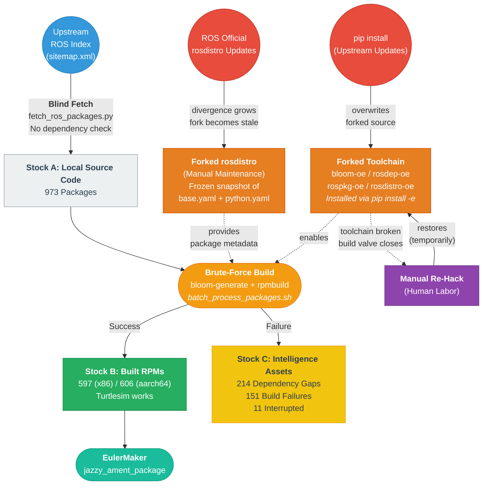

# v1: The Brute-Force Feasibility Probe

### Legacy System / Archive

> **SYSTEM STATUS: DEPRECATED & ARCHIVED** — This system is preserved to demonstrate the structural traps inherent in fork-based toolchain adaptation. Its value lies not in its code, but in the **data** it generated and the **lessons** it taught.

---

## 1. System Definition

**v1** (codename: _The Hammer_) is a one-way brute-force pipeline designed to make ROS 2 Jazzy run on openEuler 24.03 LTS — an OS not officially supported by the ROS toolchain.

- **System Goal:** Proof of Feasibility. Make `turtlesim` run on openEuler. Validate that the majority of ROS Jazzy packages can be compiled.
- **System Strategy:** Fork the ROS toolchain (bloom, rosdep, rospkg, rosdistro), register openEuler as a supported platform, then brute-force build the entire ROS Desktop stack.
- **System Boundary:**
  - **Inside:** The 4-stage pipeline (toolchain porting -> package fetch -> RPM build -> distribution), and the data it produces.
  - **Outside:** The upstream ROS ecosystem, openEuler base OS, EulerMaker build infrastructure.

### System Output (EulerMaker)

Build results: [jazzy_ament_package on EulerMaker](https://eulermaker.compass-ci.openeuler.openatom.cn/project/overview?osProject=jazzy_ament_package)

| Platform | Architecture | Status | Count |
|:--|:--|:--|:--|
| openEuler:24.03-LTS | aarch64 | Dependency Gap | 215 |
| | | Success | **606** |
| | | Failure | 152 |
| openEuler:24.03-LTS | x86_64 | Dependency Gap | 214 |
| | | Success | **597** |
| | | Failure | 151 |
| | | Interrupted | 11 |
| **Total per arch** | | | **973** |

> Turtlesim runs successfully on openEuler 24.03 LTS (x86_64). See [demo](reports/turtlesim_demo.md).

---

## 2. System Dynamics

v1 is a **one-way throughput machine** with two structural traps that make it unsustainable.



### Trap 1: Fixes that Fail (Unprotected Fork)

In systems thinking, this is the **"Fixes that Fail"** archetype: a symptomatic fix that creates side effects making the original problem worse.

1. **The Fix:** We forked bloom, rosdep, rospkg, and rosdistro, adding openEuler as a recognized platform via proper API (rospkg `OpenEuler` class, rosdep `register_rhel_clone()`). These forks were installed via `pip install -e .` into the build environment.
2. **The Side Effect:** Any standard `pip install` operation (e.g., installing `bloom` officially) triggers dependency resolution that **overwrites the forked packages** with upstream versions. The environment silently reverts to not recognizing openEuler.
3. **The Escalation:** Each overwrite requires manual re-installation of all forks. The maintenance burden scales linearly with the frequency of any pip-based tooling update.

> Source: [rosdep-oe report](reports/rosdep_oe_report.md) documents this exact failure mode.

### Trap 2: Data Fork Decay (Stale rosdistro)

The forked `rosdistro-oe` contains manually maintained `base.yaml` and `python.yaml` files mapping ROS dependency keys to openEuler package names.

- As the official `ros/rosdistro` receives updates (new packages, version bumps), the fork diverges.
- The automation script (`auto_generate_openeuler_yaml.py`) can partially mitigate this, but it requires running `dnf list` on an openEuler machine for each package — it cannot run in CI or offline.

---

## 3. Mechanism (System Structure)

The pipeline consists of 4 layers, each corresponding to a directory under `mechanism/`.

### Layer 0: Toolchain Porting (`mechanism/0_toolchain_porting/`)

**Purpose:** Make the ROS build toolchain recognize openEuler as a valid platform.

| Component | What was done | Forked Repo |
|:--|:--|:--|
| **rospkg** | Added `OpenEuler(OsDetector)` class, checks `/etc/openEuler-release` | [rospkg fork](https://github.com/Sebastianhayashi/rospkg) |
| **rosdep** | Added `register_openeuler()` in `platforms/redhat.py`, registered as RHEL-family | [rosdep-oe](https://github.com/Grvzard/rosdep-oe) |
| **rosdistro** | Forked `ros/rosdistro`, added `openeuler: ['24.03']` to `distribution.yaml`, supplemented `base.yaml` | [rosdistro-oe](https://github.com/Sebastianhayashi/rosdistro-oe) |
| **bloom** | Modified dependency requirements to use the forked rosdep/rosdistro | [bloom-oe](https://github.com/Sebastianhayashi/bloom-oe) |

Toolchain versions: Python 3.11.6, rospkg 1.5.1, bloom 0.12.0, rosdep 0.25.1, rosdistro 1.0.1.

Docs: [01_rospkg_porting](mechanism/0_toolchain_porting/01_rospkg_porting.md) | [02_rosdep_porting](mechanism/0_toolchain_porting/02_rosdep_porting.md)

### Layer 1: Blind Fetch (`mechanism/1_blind_fetch/`)

**Purpose:** Acquire all ROS Jazzy source packages.

- `fetch_ros_packages.py` scrapes `https://index.ros.org/sitemap.xml`, extracts GitHub repo URLs, and clones the `jazzy` branch (falls back to default) with 32 threads.
- **No dependency analysis.** Every package on the sitemap is pulled indiscriminately.
- Result: **973 packages** cloned to local storage.

### Layer 2: Brute-Force Build (`mechanism/2_brute_build/`)

**Purpose:** Generate RPM spec files and source tarballs for every package.

- `process_ros_packages.sh`: Per-package processing via `bloom-generate rosrpm --os-name openeuler --os-version 24.03 --ros-distro jazzy`. Extracts Name/Version from generated spec, creates tar.gz, copies to rpmbuild SPECS/SOURCES.
- `batch_process_packages.sh`: Parallel orchestrator using GNU `parallel -j32`. Recursively finds ROS packages (CMakeLists.txt + package.xml), dispatches to `process_ros_packages.sh`, logs missing rosdep keys and skipped packages.

### Layer 3: Distribution (`mechanism/3_distribution/`)

**Purpose:** Deliver built packages to EulerMaker for final compilation.

- `upload_to_gitee.py`: Creates Gitee repos per package (spec + tarball + auto-generated README), pushes via git.
- `make_gitee_repos_public.py`: Batch converts private Gitee repos to public (EulerMaker requires public access).
- `batch_upload_ros.py`: Submits packages to EUR/Copr build system via the copr API.

---

## 4. Post-Mortem: Stocks & Flows

### Feasibility Stock (Success)

61% of probed packages compiled successfully. **263 packages** are installable from the EulerMaker repository. Turtlesim, the canonical ROS demo, runs end-to-end.

Full package list: [data/installed_packages.md](data/installed_packages.md)

### Intelligence Stock (Failure Data)

> **"Failures are not waste; they are intelligence."**

The 214 dependency gaps and 151 build failures constitute the most valuable output of v1. They form the **input manifest** for v2: each gap is a specific, actionable item that tells us exactly what openEuler is missing.

Key failure categories:
- **LTTng-Tools absence**: `lttng-tools` not in openEuler repos, blocking `ros-jazzy-tracetools` and the entire `rmw-fastrtps` chain. See [compilation report](reports/lttng_tools_compilation.md).
- **TBB version conflict**: openEuler's TBB package is too old for ROS Jazzy requirements.
- **T64 suffix issues** and other deep platform mismatches.

### Knowledge Stock (Reports)

All research and reports generated during the process are preserved in `reports/`:

| Report | Content |
|:--|:--|
| [bloom_tool_research](reports/bloom_tool_research.md) | What bloom is and how it works |
| [porting_bloom_on_openEuler](reports/porting_bloom_on_openEuler.md) | Making bloom-generate detect openEuler |
| [porting_rosdep](reports/porting_rosdep.md) | Adapting rosdep for openEuler |
| [rosdep_oe_report](reports/rosdep_oe_report.md) | rosdep-oe build & test results |
| [lttng_tools_compilation](reports/lttng_tools_compilation.md) | Building LTTng-Tools from source on openEuler |
| [porting_summary](reports/porting_summary.md) | Master work summary |
| [turtlesim_demo](reports/turtlesim_demo.md) | Step-by-step turtlesim on openEuler |
| [batch_upload_usage](reports/batch_upload_usage.md) | EUR batch upload tool usage |

---

## 5. Repository Structure

```
the_brute_force_probe/
│
├── README.md                                 <-- System Frontend
├── README_en.md                              <-- English Translation
│
├── mechanism/                                <-- System Structure
│   ├── 0_toolchain_porting/                  <-- [Layer 0] Toolchain fork & registration
│   │   ├── README.md                             Version index
│   │   ├── 01_rospkg_porting.md                  rospkg OpenEuler class
│   │   ├── 02_rosdep_porting.md                  rosdep + rosdistro adaptation
│   │   └── auto_generate_openeuler_yaml.py       Automated YAML generation
│   ├── 1_blind_fetch/                        <-- [Layer 1] Inflow valve
│   │   └── fetch_ros_packages.py                 Sitemap scraper + git clone
│   ├── 2_brute_build/                        <-- [Layer 2] Transform
│   │   ├── process_ros_packages.sh               Per-package bloom-generate + tar
│   │   └── batch_process_packages.sh             Parallel orchestrator
│   └── 3_distribution/                       <-- [Layer 3] Outflow valve
│       ├── upload_to_gitee.py                    Push to Gitee repos
│       ├── make_gitee_repos_public.py            Batch publicize repos
│       └── batch_upload_ros.py                   Submit to EUR/Copr
│
├── reports/                                  <-- Knowledge Stock
│   ├── bloom_tool_research.md
│   ├── porting_bloom_on_openEuler.md
│   ├── porting_rosdep.md
│   ├── rosdep_oe_report.md
│   ├── lttng_tools_compilation.md
│   ├── porting_summary.md
│   ├── turtlesim_demo.md
│   ├── batch_upload_usage.md
│   └── img/
│
└── data/                                     <-- Intelligence Stock
    └── installed_packages.md                     263 installable packages list
```

---

## 6. Conclusion

v1 answered **"Can it be done?"** — yes, 61% of ROS Jazzy compiles on openEuler, and turtlesim runs.

v1 could not answer **"Can it be sustained?"** — no. The forked toolchain is fragile (Trap 1: pip overwrites), and the forked rosdistro diverges from upstream over time (Trap 2: data decay). Both traps share the same root cause: **the system depends on maintaining forks that the upstream ecosystem actively undermines through normal operation.**

In systems thinking terms, v1 operated under **Bounded Rationality** — it optimized for the immediate goal (make it compile now) without accounting for the maintenance cost structure. As the system boundary expanded (more packages, more frequent upstream updates), this strategy encountered its **Limits to Growth**.

**v2 (The Adaptive Verification Engine)** was designed to decouple from this dependency by transforming the approach from "fork and hack at runtime" to "verify and adapt before build."
