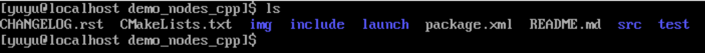
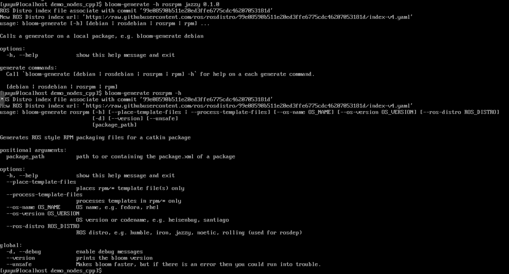

# Bloom Tool Research

## What is Bloom

`bloom` is a tool for building ROS packages as DEB or RPM packages. Developers can use this tool to build packages for different ROS versions on different operating systems.

## How Bloom Works

> Generate `.spec` from metadata

Below is a complete ROS source package:

`bloom` extracts package name, package version, and dependency relationships from files such as `CMakelists.txt` and `package.xml`.
Then it combines this with the OS and ROS version provided in the command input to start the full build workflow.

When running `bloom-generate`, it also reads the `rosrelease` configuration based on the information above. Different distributions and ROS versions rely on `rosrelease` for definition.
The main role of `rosrelease` is to tell bloom how to use the current environment on the current system to complete compilation.

Based on `package.xml` and `rosrelease`, bloom automatically generates template files required for packaging. For RPM this is a `.spec` file, and for DEB this is a `.rules` file.
While generating templates, it also chooses different build tools based on dependencies, such as CMake or catkin, to execute build tasks.

These template files include:

 - Required dependencies
 - Build steps
 - Target file paths

With these templates, bloom calls its own related tools to complete tasks such as automatic dependency download and build-environment setup. It also calls related tools like `rpmbuild` or `dpkg` to perform builds based on generated templates.

After package build is completed, bloom uploads the built package to a target package repository, or publishes it to a local repository, both of which can be user-defined.

## Bloom Status on openEuler

As shown in the figure, the tool currently cannot recognize openEuler. The next step can be adapting this tool for openEuler.
