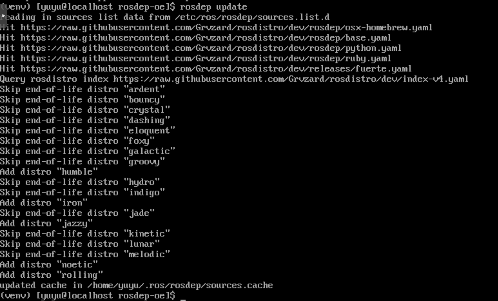

# bloom-generate Can Detect openEuler

# Background

As shown in [bloom-generate](https://github.com/Sebastianhayashi/Jazzy-euler/blob/main/Bloom_tool_research.md), the `bloom-generate` tool currently cannot recognize openEuler, so it needs to be adapted.

# rosdep

According to the content in `rosdep-oe`, it has been confirmed that `rosdep-oe` works. However, during actual `bloom` installation, dependency resolution downloads the latest `rosdep`, which overwrites the ported version (`rosdep-oe`). So the following approach was designed to run `bloom-generate`.

## Build

`bloom`, `rosdep`, and `rosdistro` are built from source because their dependency relationships need to be modified. The modified repositories are:

- [bloom](https://github.com/Sebastianhayashi/bloom-oe)
- [rosdep](https://github.com/Grvzard/rosdep-oe)
- [rosdistro](https://github.com/Sebastianhayashi/rosdistro-oe.git)

Build process:

```bash
// build rosdep-oe from source
git clone https://github.com/Grvzard/rosdep-oe
cd rosdep-oe
pip install .

// build rosdistro from source
git clone https://github.com/Sebastianhayashi/rosdistro-oe.git
cd rosdistro-oe
pip install .

// build bloom from source
git clone https://github.com/Sebastianhayashi/bloom-oe
cd bloom-pe
pip -r install requirements.txt
pip install --no-deps .
```

# Verification

Use `bloom-generate rosrpm --os-name openeuler --os-version 23.03 --ros-distro humble --help` to verify whether openEuler and its version can be detected. As shown in the figure, there is no error and related help information is printed correctly.


