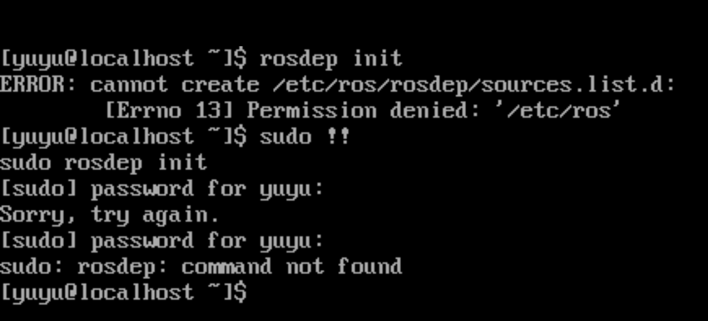
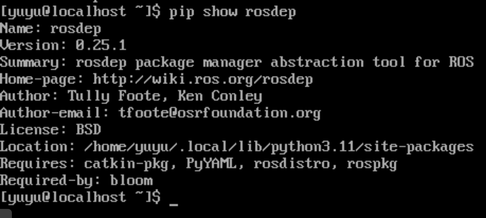

# Adapting rosdep on openEuler

## What is `rosdep`

`rosdep` is a tool that can be used in advance to prepare the environment for ROS-related tasks.

For our current task (adapting `bloom-generate` on openEuler), we first need `rosdep` to resolve relevant package dependencies on openEuler and preconfigure the environment.

## How `rosdep` Works

### System information detection

`rosdep` relies on the system file `/etc/os-release` to detect current system information, such as OS type and version.

After identifying the target system, `rosdep` looks for related config files in the `platforms` folder to map system-specific information, such as which package manager the system uses.

### Dependency installation

When resolving dependencies, `rosdep` mainly uses yaml files to get dependency mappings, then installs dependencies through the system package manager.

## Adapting `rosdep`

To adapt `rosdep` for openEuler, we first need to modify or add the following files:

- `__init__.py`
- `Platforms/openeuler.py`
- `rosdistro/rosdep`

## Current Issue

As shown in the figure, running `rosdep init` without `sudo` reports insufficient permissions. Running it with `sudo` then reports that the command cannot be found.

From `pip show`, we can see the command is recognized correctly and its install path is also printed correctly.

As shown in the figure, running the command under the corresponding path reports that the target module cannot be found.

Tried so far:

- Using a virtual environment
- Reinstalling

Next step is to reinstall the system to clean the environment. If it still fails, we will further consider building from source.
