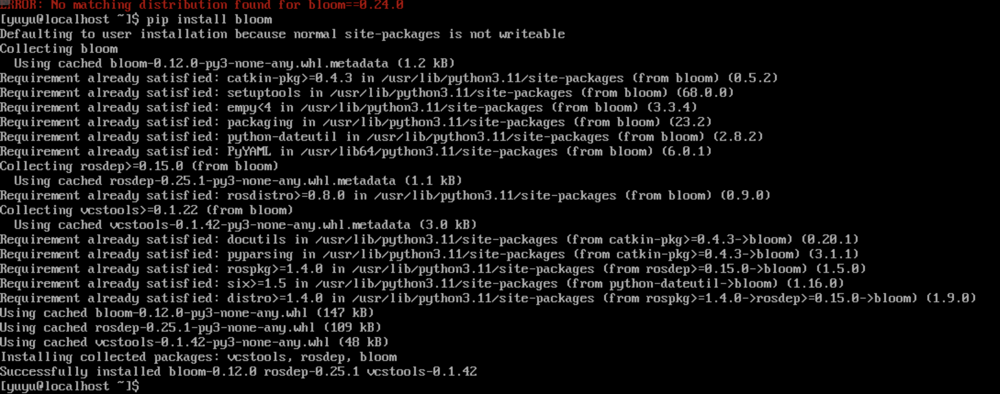

# rosdep-oe Report

Source repository: https://github.com/Grvzard/rosdep-oe.git

## Build

> Note: This build was performed in a virtual environment.

```
git clone https://github.com/Grvzard/rosdep-oe.git
cd rosdep-oe
pip install .
```

It can be built successfully, and `rodep update` works.


At the moment, `bloom` installed directly from `pip` is version 0.25, so `rosdep` 0.24 cannot be used directly. So we also plan to build `bloom` from source and use the matching version.

This issue will be addressed in the `bloom` tool report.



Also, installing `rosdep-oe` will download the ported `rospkg-oe` as a dependency, so pay attention when calling dependencies.

## Conclusion

`rosdep-oe` is expected to run on `openeuler 24.03 x86`.
